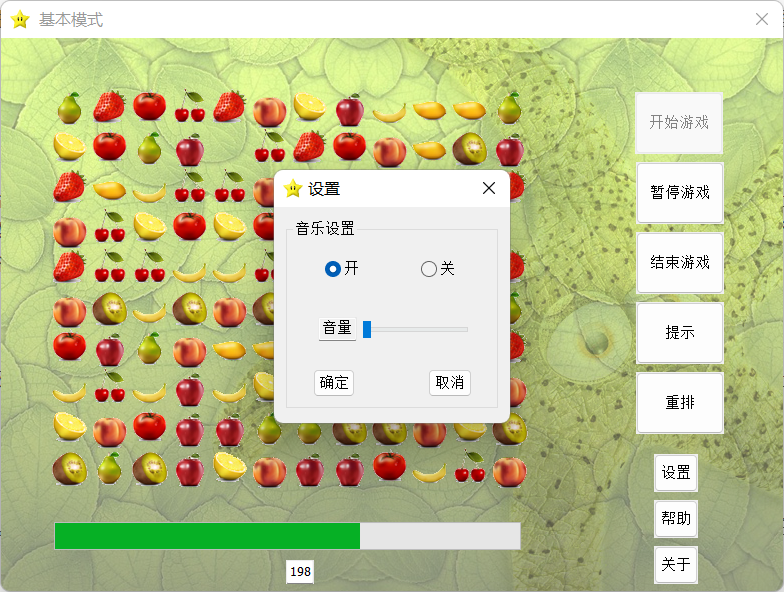
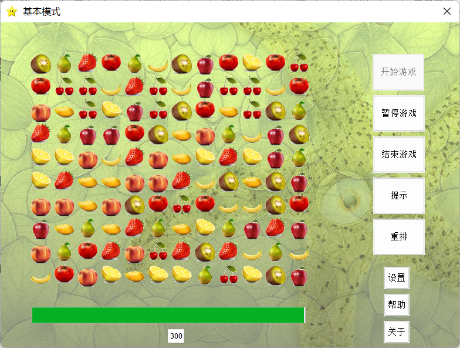
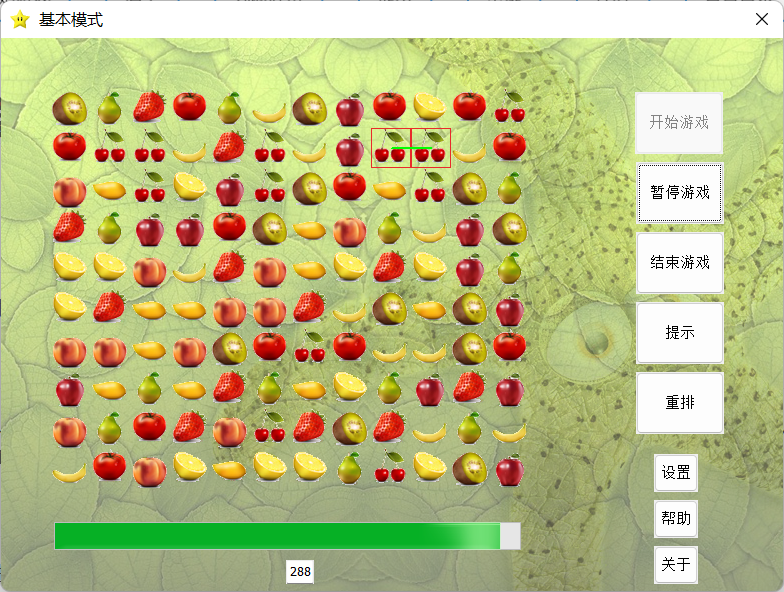
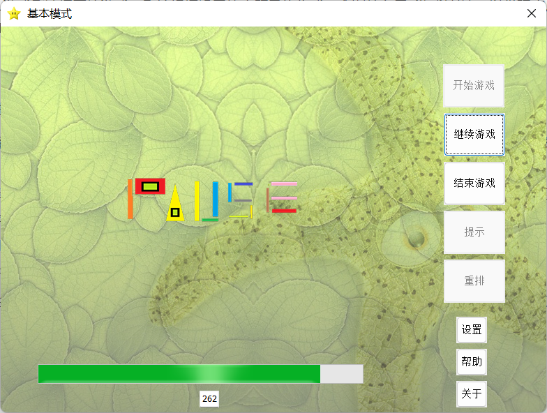
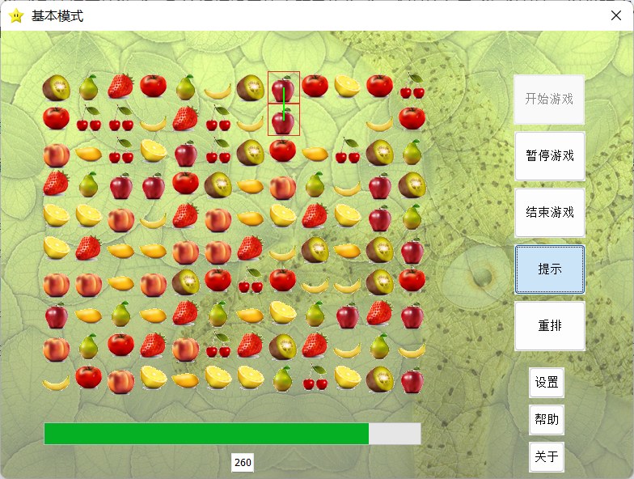
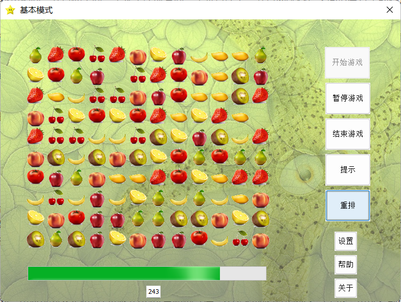
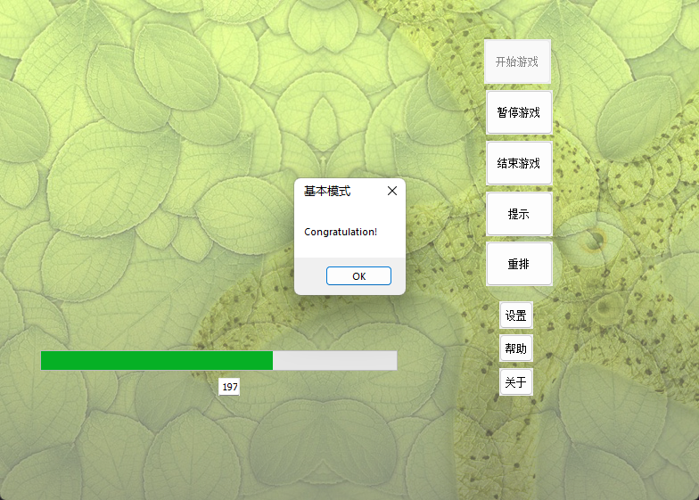
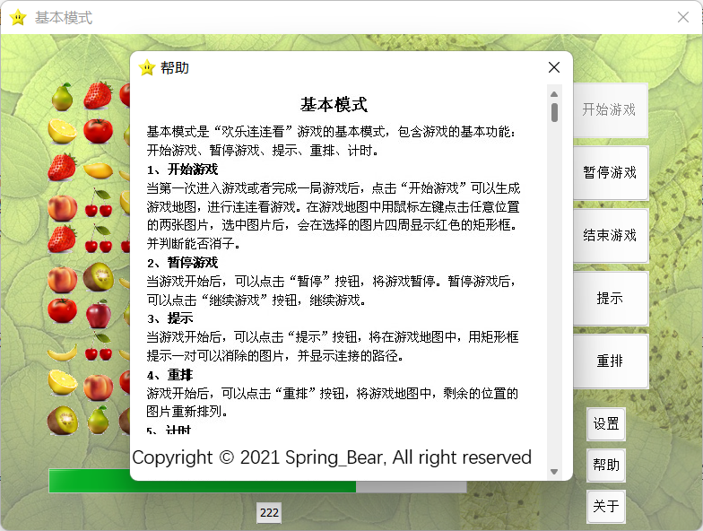
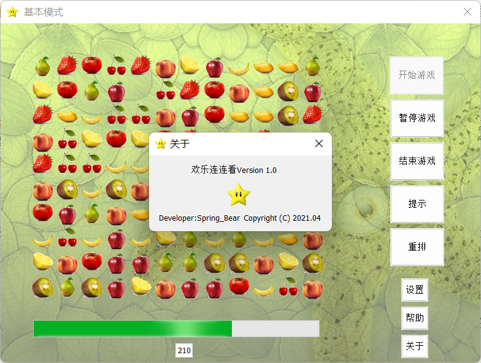

<p align="center">
    
    
    <a href="https://github.com/springbear2020/whut-matching-game" target="_blank">
    	
    </a>
</p>

# 一、快速开始

1. 克隆仓库：使用 Git 克隆仓库或直接下载仓库压缩包到您的计算机。
2. 打开工程：使用 VisualStudio2019 打开工程解决方案文件 matching-game.sln。
3. 运行项目：在 VisualStudio2019 中使用快捷键 Ctrl+F5 即可运行。

**注意事项：** 安装 VisualStudio2019 软件时需要勾选 MFC 框架，如下图所示。


# 二、项目介绍

“连连看游戏” 是在一款在给定的图案中进行相同图案配对连线消除的简单游戏，在规定时间和游戏规则约束下消除所有图案则玩家获胜，游戏规则简单易上手、游戏速度节奏快、画面清晰可爱。该项目基于 C++ 语言，使用 Microsoft 公司的 MFC(Microsoft Foundation Classes) 框架进行开发。

# 三、组织结构

```lua
whut-maching-game -- 工程文件
|—— maching-game -- 源码目录
	|—— BackgroundMusic 	-- 背景音乐
	|—— CGameControl 		-- 游戏控制：开始游戏、消子判断、获胜判断、游戏重排等
	|—— CGameDlg 			-- 游戏界面对话框
	|—— CGameLogic 			-- 核心业务逻辑：初始化地图、连接判断、路径搜索、图结构重排等
	|—— CGraph				-- 游戏地图：图结构、顶点、边等
	|—— CHelpDialog 		-- 游戏帮助对话框
	|—— CSettingDialog 		-- 游戏设置对话框
	|—— CVersionDlg 		-- 游戏版本对话框
	|—— framework 			-- MFC 核心头文件
	|—— global 				-- 全局常量
	|—— LLK 				-- 程序入口
	|—— LLKDlg 				-- 主界面对话框
	|—— pch					-- 源码预编译支持头文件
	|—— resource			-- Microsoft Visual C++ generated include file. Used by LLK.rc
	|—— targetver			-- Including SDKDDKVer.h defines the highest available Windows platform
	|—— resources 			-- 资源目录：图片、音乐等
|—— document -- 资源文件
	|—— img 	-- 系统效果展示图片
	|—— pdf 	-- 项目开发指导文件
|—— matching-game.sln -- 工程解决方案
```

# 四、功能架构


# 五、效果展示
## 5.1 欢迎界面


## 5.2 背景音乐

当玩家打开游戏主界面时即自动播放背景音乐，在游戏过程中可对背景音乐进行暂停。



## 5.3 游戏界面

玩家选择游戏模式，进入游戏后选择开始游戏，系统根据设置的主题风格生成一个图片布局 (游戏地图)，以供玩家点击消除。游戏地图大小为 640\*400，是一个 16 行 \* 10 列矩形，分成 160 个小正方形，存放 160 张图片，每张图片大小为 40\*40。



## 5.4 游戏消子

对玩家选中的两个图案进行判断，是否符合消除的规则。只有符合以下条件的图案对才会消失：

-  一条直线连通：选择的两张图片花色相同，并且处于同一条水平线或者同一条垂直线上，并且两张图片之间没有其余的图片，则可以进行一条直线消子。
- 两条直线连通：选择的两条图片花色相同，既不在同一水平线上，也不再同一垂直线上，两个图片的连通路径至少有两条直线组成，两条直线经过的路径必须是空白，中间只要有一个非同种类的图片，该路径无效。
- 三条直线连通：使用一个折点的路径无法连通的两个图片，只能如图中连线所示连通，即连通路径有三条直线，在该直线的路径上没有图案出现，只能是空白区域。

如果可以消除，从游戏地图中提示连接路径，然后消除这两种图片，并计算相应的积分。如果不能消除，则保持原来的游戏地图。



## 5.5 暂停界面



## 5.6 游戏提示

当玩家选择提示功能时，提示玩家符合游戏规则可以消除的一对图片。如果游戏地图中没有能够消除的一组图片，则提示玩家没有能够消除的图片。提示游戏地图从左上角开始，查找满足消子规则可以消除的一对图片，在该图片间绘制连接线。查找的顺序从第一行第一列开始，按照从左到右的顺序，直到第一行最后一个，如果没有相同的，从第二行第一列开始查找，依次类推。



## 5.7 游戏重排

对游戏地图中剩下的图片进行重新排列，重新排列只是将所有的图片的位置随机互换，不会增加图片的种类与个数。重排之前没有图片的位置，重排之后也不会有图片。



## 5.8 判断胜负

当游戏完成后，需要判断游戏的胜负。不同模式下，判断胜负的规则不同。基本模式时，如果在 5 分钟内，将游戏地图中所有的图片都消除，则提示玩家获胜。



## 5.9 帮助信息



## 5.10 版本信息



# 六、许可证

```
MIT License

Copyright (c) 2023 Spring-_-Bear

Permission is hereby granted, free of charge, to any person obtaining a copy
of this software and associated documentation files (the "Software"), to deal
in the Software without restriction, including without limitation the rights
to use, copy, modify, merge, publish, distribute, sublicense, and/or sell
copies of the Software, and to permit persons to whom the Software is
furnished to do so, subject to the following conditions:

The above copyright notice and this permission notice shall be included in all
copies or substantial portions of the Software.

THE SOFTWARE IS PROVIDED "AS IS", WITHOUT WARRANTY OF ANY KIND, EXPRESS OR
IMPLIED, INCLUDING BUT NOT LIMITED TO THE WARRANTIES OF MERCHANTABILITY,
FITNESS FOR A PARTICULAR PURPOSE AND NONINFRINGEMENT. IN NO EVENT SHALL THE
AUTHORS OR COPYRIGHT HOLDERS BE LIABLE FOR ANY CLAIM, DAMAGES OR OTHER
LIABILITY, WHETHER IN AN ACTION OF CONTRACT, TORT OR OTHERWISE, ARISING FROM,
OUT OF OR IN CONNECTION WITH THE SOFTWARE OR THE USE OR OTHER DEALINGS IN THE
SOFTWARE.
```

